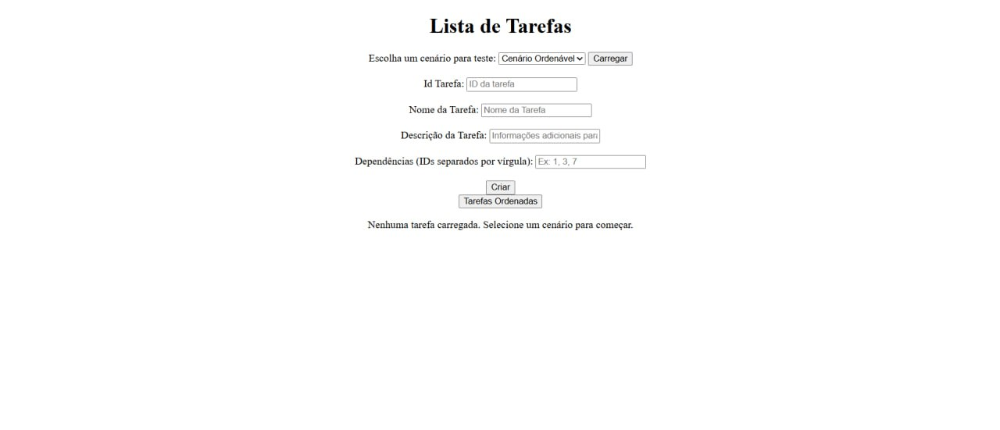
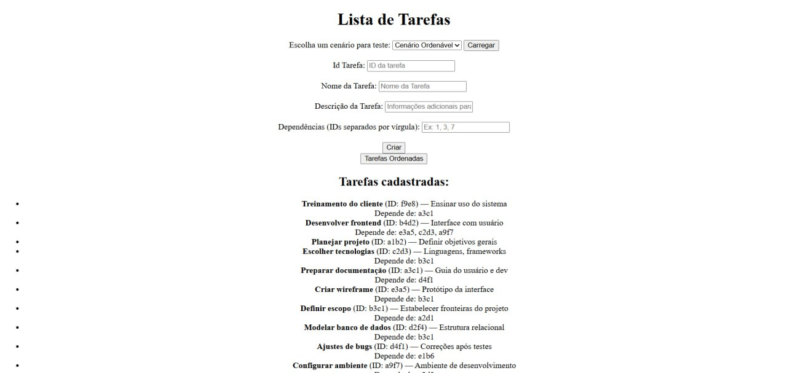
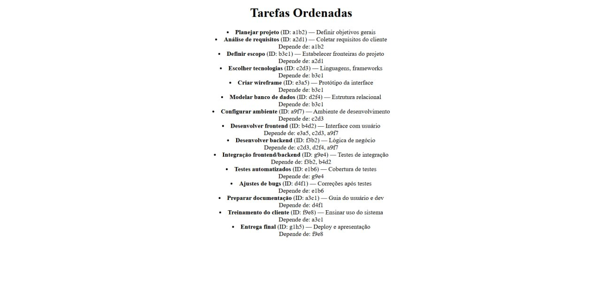
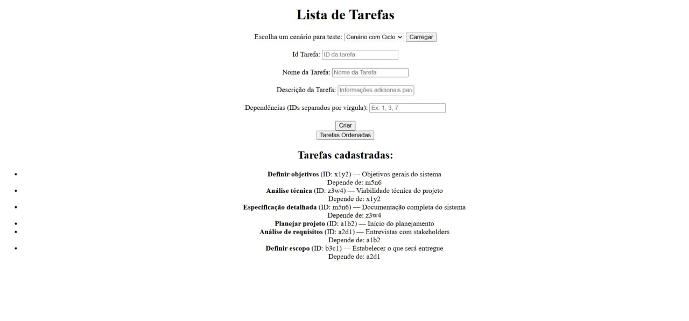
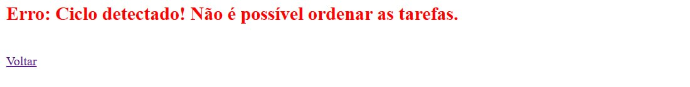

# TaskList

**Número da Lista**: X<br>
**Conteúdo da Disciplina**: Projeto de Algoritmos<br>

## Alunos
|Matrícula | Aluno |
| -- | -- |
| 22/1007958  |  Cláudio Henrique dos Santos Carvalho |
| 22/1007706  |  Elias Faria de Oliveira |

## Sobre 
O TaskList apresenta um sistema de gerenciamento de atividades e tarefas com base na precedência de outras tarefas. O sistema possibilitará a criação de tarefas, edição e exclusão de tarefas. Ela mostrará o fluxo de execução das tarefas, obedecendo a ordem topológica e a precedência das tarefas criadas.

A aplicação possuirá um grafo contendo as tarefas sendo os nós do grafo e a precedência entre elas as arestas que ligarão uma a outra.

## Screenshots

Screenshot da tela Home do projeto:



Screenshot das tarefas carregadas que podem ser ordenadas:



Screenshot das tarefas ordenadas:



Screenshot das tarefas com ciclo que não podem ser ordenadas:



Screenshot da tela de erro das tarefas com ciclo:



## Vídeo de apresentação e explicação do sistema TaskList

[Link da Gravação](https://youtu.be/FOjtSsT-_0E)

## Instalação 
**Linguagem**: Python 3.12.3<br>
**Framework**: Flask 2.3.2<br>

1. Tendo o Python instalado na sua máquina, basta clonar o projeto e rodar o comando abaixo na pasta raiz:

    ```pip install -r requirements.txt```

2. Depois, dentro da pasta ```tasks-list``` execute o arquivo ```app.py``` com o comando:
    ```python app.py```

3. Você verá algo assim no terminal:

    ```* Running on http://127.0.0.1:5000/```

4. Abra seu navegador e acesse:

    ```http://127.0.0.1:5000/```

## Uso 

Basta abrir o endereço ```http://127.0.0.1:5000/``` no navegador e cadastrar algumas tarefas com dependências entre si, ou se preferir, pode carregar os templates cadastrados na aplicação.

## Outros 
Quaisquer outras informações sobre seu projeto podem ser descritas abaixo.